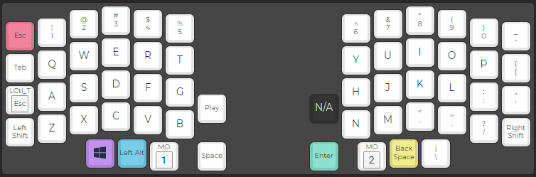
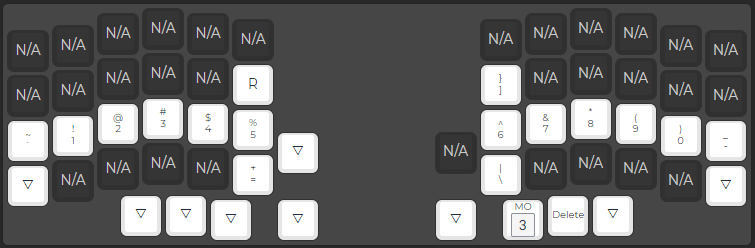
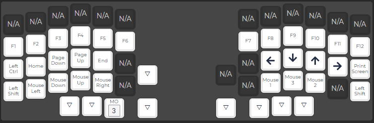
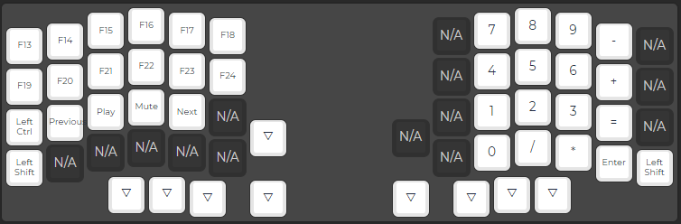

# Oli's keymap

This is my keymap for the Lily58 keyboard and the [Programmer Dvorak Keyboard Layout](http://www.kaufmann.no/roland/dvorak/).

## Notes

- My keyboard currently has two broken keys which is why there is a P on the Symbols layer.  

## Layers

### Layer 0: Base layer

This is where your basic letters live in addition to some symbols on the top row.

The homing thumb fingers are used to access the different layers.

- The homing left thumb finger gives access to the Symbols layer
- The homing right thumb finger gives access to the Navigation layer
- Pressing both homing thumb fingers gives access to the Numpad layer

### Layer 1: Symbols

The Symbols layer gives access to some symbols in addition to the delete key as an alternate to backspace.  

### Layer 2: Navigation

The Navigation layer gives access the arrow keys on the right hand, navigation keys on the left hand in addition to a function key row.  
In addition to this there are also mouse controls.

### Layer 3: Numpad

The Numpad layer exposes a numpad on the right hand and media and extra function buttons on the left hand.
